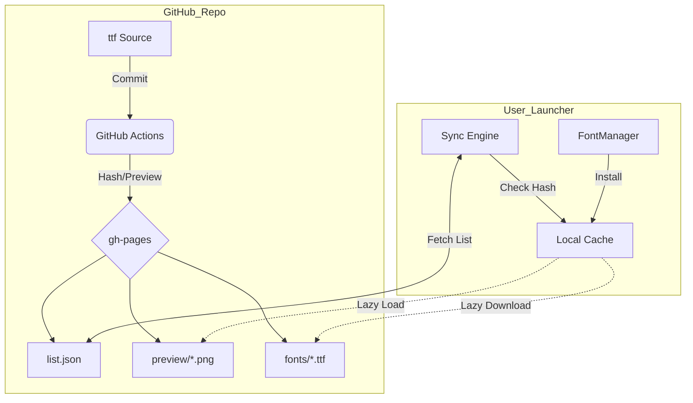

---
[CONTEXT_HANDOVER]
- **Status**: Research & Design Phase (Refining Research)
- **Objective**: 0% Font Embedding (Strict License Compliance) via gh-pages.
- **Key UX**: 'Font Catalog' Modal with Robust Error Handling.
  - Fail message: "폰트를 가져올 수 없습니다."
  - Confirm modal on download failure.
- **Infrastructure**: Local `scripts/` driven GitHub Actions Workflow.
- **Next Step**: Draft `implementation_plan.md` based on this research.
---

# 폰트 자원 외부화 및 원격 동기화 시스템 설계 리서치

## 1. 개요 및 배경
- **목적**: 폰트 라이선스 이슈를 해결하기 위해 실행 파일(패키지) 내부에 폰트를 포함하지 않고, 외부 저장소(`gh-pages`)에서 필요한 자원을 동적으로 동기화하는 구조를 설계합니다.
- **핵심 가치**: 
    - 법적 안전성 확보 (라이선스 분리)
    - 런처 패키지 경량화
    - 폰트 추가 및 수정 시 런처 업데이트 없이 즉시 반영 가능

## 2. 기존 자동화 모델 분석 (Notice & Theme)
- **공지(Notice) 시스템**: `gh-pages` 브랜치의 MD 파일을 트리거로 `scripts/generate-notice-list.js`를 실행하여 JSON 목록을 생성하고 배포.
- **테마(Theme) 시스템**: 테마 설정 및 이미지 자원의 해시값을 관리하여 변경 사항을 동기화.
- **폰트 시스템 적용 방안**: 위 두 시스템을 결합하여, 폰트 바이너리 변경 시 해시를 갱신하고 미리보기(PNG)를 자동 생성하는 파이프라인 구축.

## 3. 원격 데이터 구조 설계 (Proposed)

### 3.1 저장소 구조 (`gh-pages` 브랜치)
```text
/fonts
  ├── list.json         # 폰트 메타데이터 및 해시 정보
  ├── kodia.ttf         # 폰트 바이너리
  ├── preview/
  │    └── kodia.png    # 자동 생성된 미리보기 이미지
```

### 3.2 `fonts/list.json` 스펙 (TypeScript Interface)
```typescript
/**
 * gh-pages/fonts/list.json 내의 개별 폰트 항목
 */
export interface RemoteFontItem {
  id: string;          // 고유 식별자 (파일명 해시 기반 권장)
  alias: string;       // 사용자에게 보여질 이름 (기본값: 파일명, 수동 수정 가능)
  fileName: string;    // 실제 폰트 파일명 (예: "spoqa.ttf")
  hash: string;        // 파일 무결성 검증용 SHA256 해시
  previewPath: string; // 자동 생성된 썸네일 상대 경로
  fileSize: number;    // 다운로드 예상 용량 (Bytes)
  license: string;     // 라이선스 명칭 (예: "OFL-1.1")
  licenseUrl: string;  // 라이선스 전문 링크
  createdAt: string;   // 등록일 (ISO 8601) - 최초 등록 시 생성 및 보존
  updatedAt: string;   // 수정일 (ISO 8601) - 바이너리 변경 시 갱신
  category?: string;   // 폰트 분류 (추후 확장용)
}
```

## 4. GitHub Actions 워크플로우 설계 (`automate-font-list.yml`)

> [!IMPORTANT]
> **Renovate 호환성**: 모든 액션은 프로젝트의 Renovate 정책에 따라 `Commit Hash` + `Version Comment` 형식을 준수합니다.

```yaml
name: Global Font Asset Sync

on:
  push:
    branches: [gh-pages]
    paths: ["fonts/*.ttf", "fonts/*.otf"]
  workflow_dispatch:

jobs:
  process-fonts:
    runs-on: ubuntu-latest
    steps:
      - name: Checkout
        uses: actions/checkout@de0fac2e4500dabe0009e67214ff5f5447ce83dd # v6.0.2
        with:
          ref: gh-pages

      - name: Set up Node.js
        uses: actions/setup-node@53b83947a5a98c8d113130e565377fae1a50d02f # v6.3.0
        with:
          node-version: "24"

      - name: Install Native Dependencies
        run: |
          sudo apt-get update
          sudo apt-get install -y libcairo2-dev libpango1.0-dev libjpeg-dev libgif-dev librsvg2-dev

      - name: Generate Font Index & Previews
        run: |
          # gh-pages 브랜치에는 스크립트 소스가 없으므로 master 브랜치에서 로직을 가져와 실행
          mkdir -p scripts
          curl -s https://raw.githubusercontent.com/${{ github.repository }}/master/scripts/generate-font-assets.ts -o scripts/generate-font-assets.ts
          npx ts-node scripts/generate-font-assets.ts

      - name: Commit and push changes
        run: |
          git config --global user.name "github-actions[bot]"
          git config --global user.email "github-actions[bot]@users.noreply.github.com"
          git add fonts/list.json fonts/preview/*.png
          git commit -m "chore: sync remote font assets [skip ci]" || echo "No changes to commit"
          git push origin gh-pages

## 4.1 자동화 스크립트(`generate-font-assets.ts`) 상세 로직
- **폰트 분석**: `opentype.js`를 사용하여 TTF/OTF 파일의 명칭(Family Name), 라이선스 전문, 버전 정보 추출.
- **해시 생성**: 파일 바이너리 기반 `SHA256` 해시 생성 (동기화 및 캐싱 기준값).
- **미리보기 렌더링**: `node-canvas`를 사용하여 폰트별 샘플 텍스트("The Quick Brown Fox...")가 담긴 PNG 파일 생성.
- **인덱스 갱신 (Smart Merge Logic)**: 
    - 기존 `fonts/list.json`을 먼저 로드함.
    - 신규 폰트 발견 시: 파일명을 `alias` 기본값으로 설정하고 `createdAt` 기록.
    - 기존 폰트 재감지 시: 
        - **수동 수정 보존**: 사용자가 수동으로 수정한 `alias`, `licenseUrl` 등은 그대로 유지.
        - **자동 갱신**: 파일 바이너리 해시가 변경된 경우에만 `hash`, `fileSize`, `updatedAt` 갱신.
    - 모든 정보를 배열 형태로 직렬화하여 저장.
```

## 5. UI/UX 상세 설계: 폰트 카탈로그 (Font Catalog)

### 5.1 사용자 여정 (User Journey)
1. 사용자가 폰트 설정 탭에서 **[새 폰트 추가]** 버튼 클릭.
2. 기동 시 동기화 실패 상태라면 **"폰트를 가져올 수 없습니다. 인터넷 상태를 확인해 주세요."** 문구를 강조 표시.
3. 성공 시 **`FontCatalogModal`** 오픈 -> 서버에서 최신 `list.json` 로드.
4. 폰트 목록을 보며 마우스를 올려 미리보기(Thumbnail) 확인.
    - **지연 로딩(Lazy Loading)**: Intersection Observer를 사용하여 화면에 노출되는 카드만 미리보기 로드.
    - 카드 하단에 **파일 용량(예: 1.2 MB)**을 표시하여 다운로드 전 정보 제공.
5. 마음에 드는 폰트의 **[다운로드]** 버튼 클릭.
    - 버튼이 **프로그레스 바** 형태로 상태 전이 (기존 `UpdateModal.tsx`의 디자인 언어 계승).
    - 다운로드 중 오류 발생 시 **"다운로드에 실패했습니다. (원인)"** 컨펌 모달 노출 (재시도/취소 선택).
7. **[별칭(Alias) 설정]** 팝업 등장 (기본값은 폰트 원본 이름).
8. 확인 클릭 시 메인 프로세스에서 실제 바이너리 다운로드 및 `%AppData%` 저장.
9. 완료 시 런처 폰트 리스트에 즉시 반영 및 모달 종료.

### 5.2 카탈로그 모달 레이아웃
- **상단**: "PoE2 온라인 폰트 저장소" 타이틀 및 안내.
- **중앙**: 스크롤 가능한 폰트 카드 리스트 (미리보기 + 폰트명 + 라이선스).
- **하단 제어바**: 
    - **[수동 파일 추가]** (왼쪽): 
        - 로컬 파일 탐색기를 통해 TTF/OTF 파일 직접 선택.
        - **일관된 정책 적용**: 수동 추가된 폰트도 `FontMutatorWorker`를 통해 Name Table 변조 및 캐시 ID 생성을 거쳐 시스템 폰트 충돌 방지.
    - **[닫기]** (오른쪽): 모달 닫기.

## 6. 런처 로직 마이그레이션 전략

### 6.1 삭제 대상 (The Purge)
- `src/main/assets/fonts/defaults/` 하위 TTF 파일 및 `manifest.json`.
- `FontManager.generatePreviewPNG()`: 런처 내 캔버스 로직 제거.
- `package.json`의 `canvas` 의존성 제거.

### 6.2 유지 및 재사용 (The Core)
- **`FontMutatorWorker.ts`**: 다운로드된 폰트의 Name Table 변조를 위해 100% 재사용.
- **`PowerShellManager.ts`**: 시스템 폰트 설치/삭제 로직 보존.

### 6.3 함수 레벨 상세 설계
| 함수명 | 처리 방식 | 상세 내용 |
| :--- | :--- | :--- |
| `initializeDefaultFonts` | **교체** | `syncWithRemoteStore()`로 대체 (Remote `list.json` 패치) |
| `addFontInternal` | 리팩토링 | 로직 내의 `fs.copyFile`을 `downloadAndCache()`로 전환 |
| `applyBatch` | **재사용** | 폰트 설치 로직 유지하되, 설치 전 파일 가용성 체크 및 다운로드 단계 삽입 |
| `getUnifiedFonts` | 리팩토링 | `UnifiedFontData` 인터페이스 유지로 렌더러 소스 수정 최소화 |

## 7. 예외 상황 대응 및 무결성 관리

### 7.1 안전 장치 및 오류 처리 정책
- **내장 폰트 0% 원칙**: 라이선스 법적 리스크를 완전히 차단하기 위해 단 하나의 폰트 바이너리도 패키지에 포함하지 않습니다.
- **동기화 실패 시**: 앱 기동 중 `list.json` 로드 실패 시 "폰트 데이터를 가져올 수 없습니다. 인터넷 연결을 확인해주세요." 안내 메시지를 표시합니다.
- **다운로드 실패 시**: 개별 폰트 다운로드 실패 시 `Confirm/Alert Modal`을 띄워 사용자에게 재시도 여부를 묻거나 실패 원인을 고지합니다.
- **원자적 쓰기**: `tmp_{hash}.ttf` 다운로드 후 해시 검증 통과 시에만 정규 파일로 전환하여 파일 깨짐을 방지합니다.
- **클린업**: 서버 목록에서 사라진 미사용 로컬 캐시 폰트(Orphaned files)는 디스크 용량 관리를 위해 자동 삭제합니다.
- **오프라인 모드**: 이전에 성공적으로 다운로드한 폰트가 있다면, `list.json.bak`을 활용하여 오프라인 상태에서도 기존 폰트 설정을 유지합니다.

## 8. 최종 아키텍처 요약도


